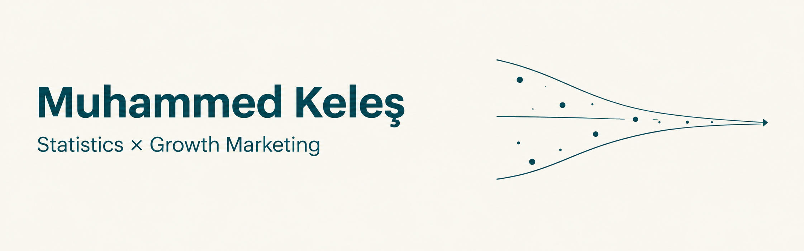

  

# Hi, I'm Muhammed Keleş 👋

Final-year Statistics student at Hacettepe University (Ankara, Türkiye),
interested in marketing and growth. I use statistics and data analysis to
understand customers, content performance and funnels, and I test those
ideas on my own content projects.

## Marketing experience
- **Marketing intern, BlueSense** – worked on positioning, promotion
  strategy and content creation for the Smart Beauty mobile app
  (short-term internship).
- **Content & digital products** – run faceless Instagram, TikTok and
  YouTube theme pages built around short-form video (Reels/Shorts) trends,
  and sell digital products through them.
- **Marketing automation** – built workflows with n8n and ManyChat.

## Skills
- **Data & analysis:** Python (pandas), R, SQL, Excel, Power BI, SPSS
- **Marketing & automation:** n8n, ManyChat, Canva, CapCut
- **AI creative tools:** Midjourney, DALL-E, HeyGen, Luma, Kling, Veo

## Contact
📧 emuhammedkeles@gmail.com
🔗 [LinkedIn](https://www.linkedin.com/in/muhammed-keles)
